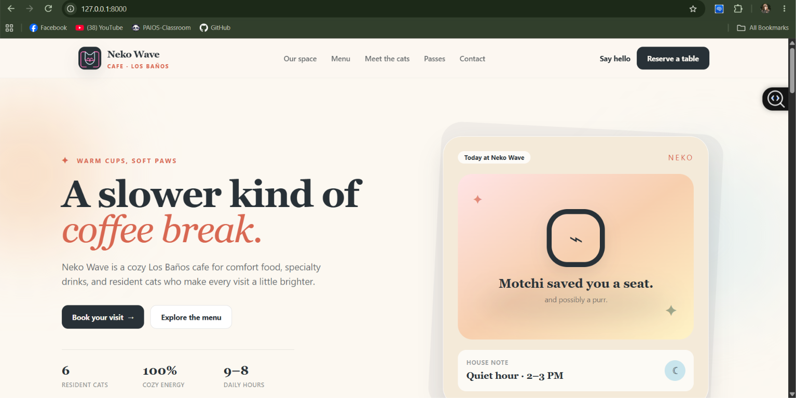
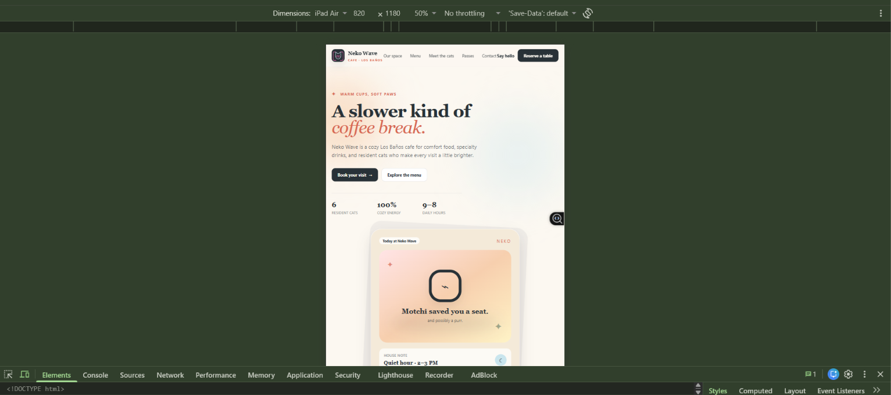
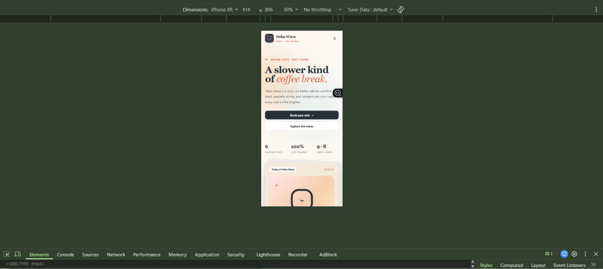
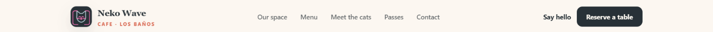
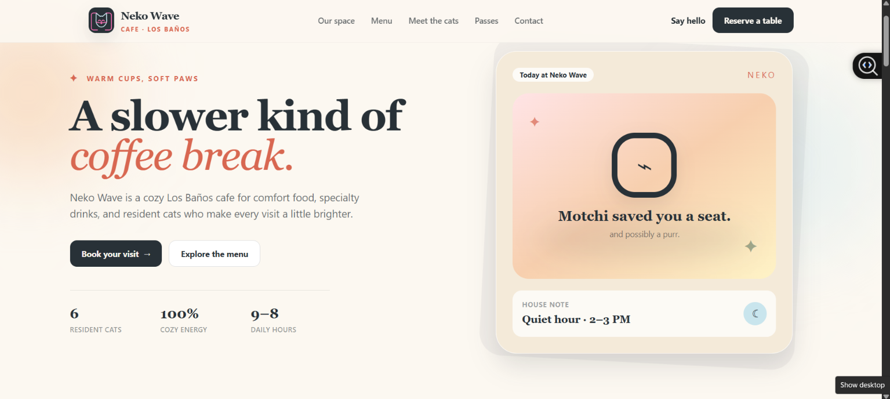
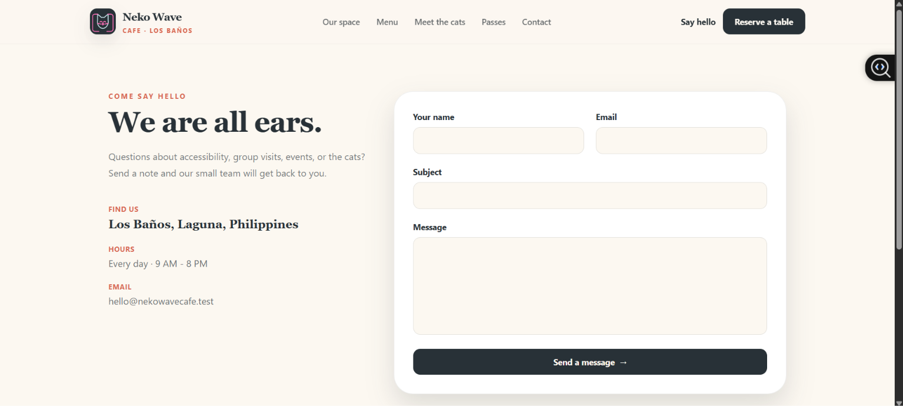
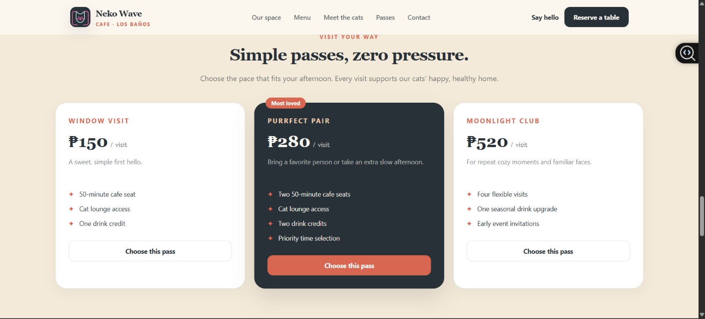
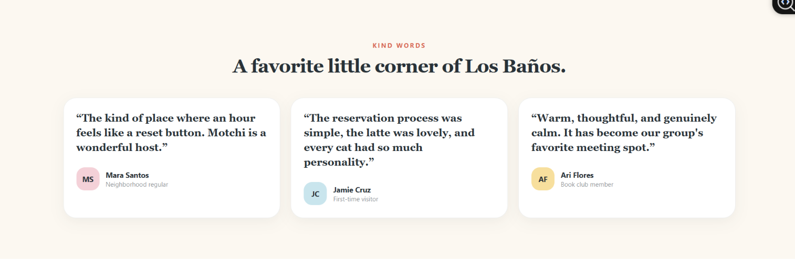
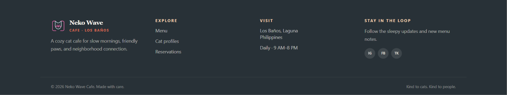
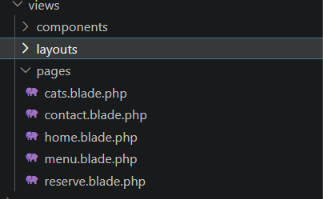

# Neko Wave Cafe

A responsive Laravel application for a cozy cat cafe. Neko Wave pairs a polished product-landing experience with practical cafe features: a database-backed menu, resident cat profiles, reservation requests, and a contact form.

## Introduction

A product landing page is a focused digital front door for a business. It introduces the brand, explains what makes the experience valuable, builds trust, and guides a visitor toward an action. For Neko Wave Cafe, that action is reserving a calm, cat-friendly visit.

Landing pages matter because a visitor should be able to understand a business quickly on any device. This project translates the warm, slow-living feeling of a cat cafe into a clear and welcoming web experience without relying on external image assets.

## Objectives

- Build a mobile-first interface with Laravel, Blade Components, and Tailwind CSS.
- Create reusable UI components that prevent duplicated markup.
- Apply responsive Grid, Flexbox, spacing, typography, cards, shadows, and hover states.
- Model a cafe menu, cat profiles, reservation requests, and contact messages in Laravel.
- Document the interface architecture and a before/after design rationale.

## Features

- Responsive home page with navigation, hero, six feature cards, menu showcase, HTML-only dashboard preview, pricing passes, testimonials, CTA, and footer.
- Full menu page grouped by category and cat profiles page with care-first visitor guidance.
- Validated reservation and contact forms persisted to SQLite.
- Seeded menu and cat data for a useful first run.

## Responsive Web Design

The interface starts from a single-column mobile layout and expands at Tailwind breakpoints. Flexible spacing, stacked calls-to-action, readable form controls, and a compact disclosure navigation support small screens. On larger screens, CSS Grid places related information side-by-side while Flexbox handles compact alignment patterns.

Responsive design protects the user experience: a guest deciding whether to visit should find hours, menu information, and the reservation flow just as easily on a phone as on a laptop.

## Tailwind CSS

Tailwind keeps the visual system close to the markup. The custom theme in `resources/css/app.css` defines the Neko Wave palette, display typeface, and shadows, while utility classes describe responsive layout and component states.

```blade
<div class="mt-10 grid gap-5 sm:grid-cols-2 lg:grid-cols-3">
    <x-feature-card :icon="['symbol' => '◷', 'tone' => 'peach']" ... />
</div>
```

This creates a one-column mobile grid, two columns on small screens, and three columns on large screens without separate media-query files.

## Blade Components

Reusable components keep shared UI consistent and maintainable. The assignment-required components are included in `resources/views/components`:

- `navbar.blade.php`
- `hero.blade.php`
- `feature-card.blade.php`
- `pricing-card.blade.php`
- `testimonial-card.blade.php`
- `button.blade.php`
- `footer.blade.php`

Additional components (`layout`, `section-heading`, and `cat-card`) make pages smaller and keep repeated patterns in one place. All pages use `<x-layout>`, which supplies the shared document shell, navigation, success message, and footer.

## User Interface Design

The palette is intentionally soft and high contrast: cream and warm neutrals establish the cafe feeling, charcoal ink anchors readable text, and coral gives primary actions a clear focal point. A serif display face adds warmth to headings while a clean sans-serif supports forms and body copy. Rounded cards, subtle shadows, generous whitespace, and lightweight text-symbol iconography make the interface friendly without using generated images or media.

## Folder Structure

```text
app/
  Http/Controllers/       # Page, reservation, and contact handlers
  Http/Requests/          # Validation rules
  Models/                 # Cafe domain models
database/
  migrations/             # Schema for menus, cats, reservations, messages
  seeders/                # First-run cafe data
resources/views/
  layouts/                # Main Blade document layout
  components/             # Reusable Blade UI
  pages/                  # Home, menu, cats, reservation, contact pages
documentation/            # Design evolution and portfolio copy
screenshots/              # Capture checklist (no media supplied by request)
```

## Setup

```bash
composer install
npm install
copy .env.example .env
php artisan key:generate
php artisan migrate:fresh --seed
npm run build
php artisan serve
```

Open `http://127.0.0.1:8000` after starting the server. Use `php artisan test` to run the feature tests.

## Screenshots
# Neko Wave

## Screenshots

### Figure 1. Desktop View



### Figure 2. Tablet View



### Figure 3. Mobile View



### Figure 4. Navigation Bar



### Figure 5. Hero Section



### Figure 6. Features Section



### Figure 7. Pricing Section



### Figure 8. Testimonials



### Figure 9. Footer



### Figure 10. Blade Components Folder



### Figure 11. GitHub Repository


## Before and After

See [documentation/design-evolution.md](documentation/design-evolution.md) for the initial wireframe, final structure, and design decisions. It provides an honest before/after comparison in text form so the project stays media-free.

## LinkedIn Portfolio Copy

A ready-to-personalize post is available in [documentation/linkedin-post.md](documentation/linkedin-post.md). Add your public repository link and attach your own locally captured before/after screenshots before publishing.

## Suggested Git History

Use meaningful commits as you work, for example:

1. `chore: scaffold Laravel application`
2. `feat: add cafe domain models and migrations`
3. `feat: seed menu and cat profiles`
4. `feat: create reusable navigation and hero components`
5. `feat: build responsive feature and menu sections`
6. `feat: add pricing and testimonial components`
7. `feat: build reservation request flow`
8. `feat: add contact form and validation`
9. `style: refine neko wave responsive theme`
10. `docs: add project and portfolio documentation`

## Reflection

This project demonstrates how a focused design system and Blade Components can turn a business idea into a reusable, responsive interface. It also shows that a tactile, friendly visual identity can be created in code using typography, color, and layout instead of depending on media assets.
